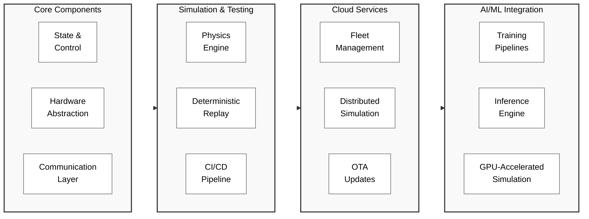
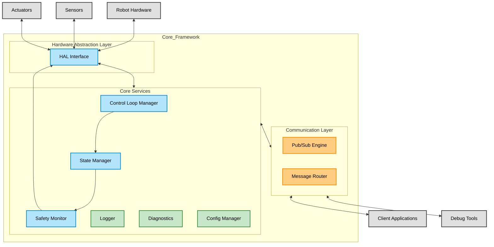

# Full-Stack Robotics Development Platform Design Document
Author: [@lgingerich](https://github.com/lgingerich)  
Date: February 5, 2025

## 1. Introduction
- **Purpose:**  
  This document outlines the design of an open source robotics software development platform.

## 2. Overview
- **Project Summary:**  
  The platform provides a unified, modern developer experience for robotics software development. Built on cloud-native best practices, it integrates managed environments, CI/CD, containerization, and real-time observability into the robotics development lifecycle.

- **Product Vision & Goals:**  
  Enable rapid development, testing, simulation, and production deployments of robotics applications, empowering a community of developers and researchers. The platform will facilitate seamless transitions between development phases.
  
- **Scope:**  
  - **Included:** Core platform functionalities such as hardware abstraction, simulation tools, APIs, and essential development services.
  - **Out-of-Scope:** Extensive third-party integrations and comprehensive customization options.

## 3. System Architecture

### Feature Categories
The platform's capabilities are organized into four main categories:

### Core Architecture
The following diagram illustrates the preliminary architecture of the Core Components, showing data flow and component interactions:

- **Core Components:**  
  The platform provides essential robotics functionality through several interconnected systems:
  
  - **State & Control:**
    - Robot state management
    - Control loop implementations
    - Motion planning interfaces
    - Safety systems
  
  - **Hardware Abstraction:**
    - Device drivers and interfaces
    - Sensor data acquisition
    - Actuator control
  
  - **Communication:**
    - Message passing between components
    - Network communication
    - Data pipeline management

- **Technology Stack:**  
  The platform will be built primarily in Rust, leveraging its performance, safety, and growing ecosystem of robotics-related tools. Below is the initial selection of core technologies, which may evolve as the project develops:

  **Core Runtime & Systems:**
  - [Tokio](https://tokio.rs/) - Asynchronous runtime providing the foundation for concurrent operations
  - [embedded-hal](https://crates.io/crates/embedded-hal) - Hardware abstraction layer for embedded systems
  - [Zenoh](https://zenoh.org/) - Modern pub/sub framework optimized for robotics and IoT

  **Simulation & Physics:**
  - [Bevy](https://bevyengine.org/) - Data-driven game engine for visualization and simulation
  - [Rapier](https://rapier.rs/) - Physics engine for accurate robot dynamics

  **Development & Debugging:**
  - [Rerun](https://www.rerun.io/) - Visualization and debugging toolkit for robotics applications

  **Additional Tools Under Consideration:**
  - [NVIDIA Isaac Sim](https://developer.nvidia.com/isaac-sim) - Advanced robotics simulation
  - [NVIDIA Cosmos](https://developer.nvidia.com/cosmos) - Graph computing for robotics
  - [Genesis](https://github.com/Genesis-Embodied-AI/Genesis) - Embodied AI framework

<!-- 
- **Architectural Patterns & Styles:**  
  Describe the chosen patterns (e.g., microservices or modular monolith) that allow for iterative development. Explain how the architecture supports both community-driven development and later integration of enterprise features.

- **Trade-offs & Constraints:**  
  Note key design decisions balancing simplicity (for open source adoption) and extensibility (to support enterprise requirements such as performance, security, policy compliance, etc.).

## 4. Detailed Design
- **Component Overview:**  
  - **Core Modules (Open Source):** Hardware abstraction, simulation engine, basic routing and communication interfaces, and development utilities.  
  - **Future Enterprise Modules:** Management dashboard, enhanced API layers, analytics modules, and additional security/authentication components.
  
- **Class / Object Design:**  
  Include initial class or module diagrams. These will be expanded over time as more functionality is added.

- **Interface & API Design:**  
  Define public interfaces and APIs with clear method signatures, input/output data contracts, and versioning strategies. Outline plans for an enterprise-ready API with extended capabilities.

- **Data Model & Database Design:**  
  Present preliminary data models for telemetry, configuration, and user data. Future iterations might include enhanced logging and analytics data models tailored for enterprise use.

## 5. Appendices
- **Glossary:**  
  Define terms and acronyms used in this document.

- **References:**  
  List any external documents, technical references, or supporting materials.

- **Change Log:**  
  Maintain a record of changes made to the document and the platform design.

- **Additional Notes:**  
  Any other pertinent details, such as future directions or known issues, not covered in other sections. -->
